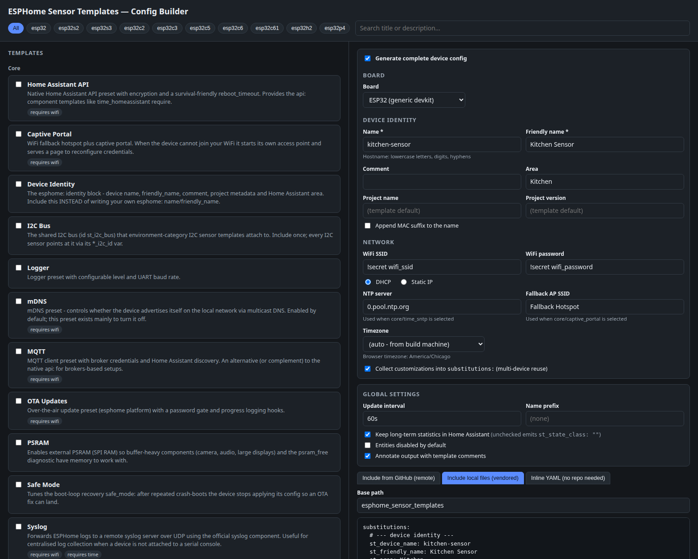
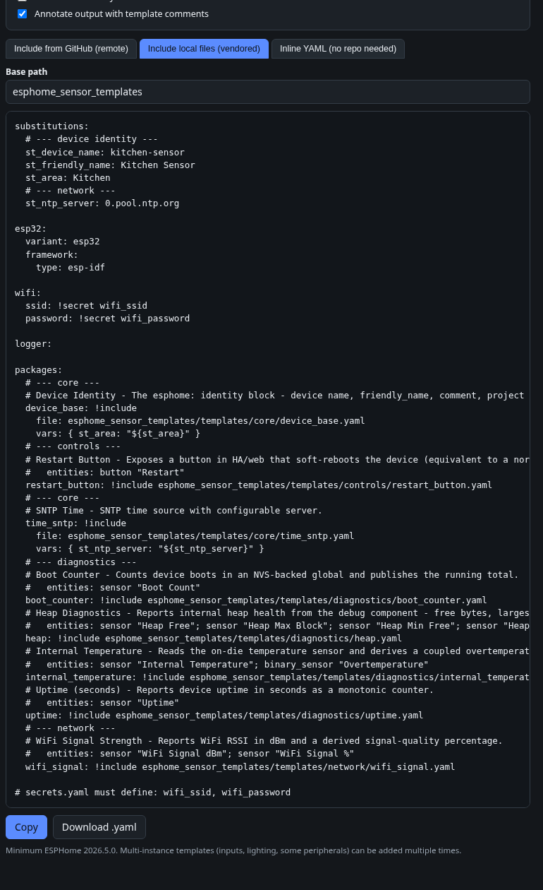

# ESPHome Sensor Templates

74 reusable, standalone ESPHome template files for ESP32-family devices (ESP-IDF framework),
plus a point-and-click **[config builder](https://pwsh.github.io/esphome_sensor_templates/)**.
Each template is a self-contained [package](https://esphome.io/components/packages/): include one
file, get a working, documented feature with sensible defaults — customize per sensor via
`vars:` or globally via top-level `substitutions:`.

**Minimum ESPHome version: 2026.5.0.** Audited platforms: ESP32, ESP32-S2, ESP32-S3, ESP32-C3,
ESP32-C6 (the builder also offers C2/C5/C61/H2/P4, marked unaudited).

**Categories:** core (14) · diagnostics (16) · network (7) · lighting (5) · audio (4) ·
environment (5) · presence (2) · bluetooth (2) · remote (4) · peripherals (4) · controls (6) ·
inputs (5) — full index below, one doc page per template in [docs/](docs/).

See [ARCHITECTURE.md](ARCHITECTURE.md) for how the system fits together and
[STATUS.md](STATUS.md) for the current project state, verification coverage, and limitations.

## Config builder

**<https://pwsh.github.io/esphome_sensor_templates/>** — pick a board (all 10 ESP32 variants),
fill in device identity/network/timezone, select templates (per-template variable editors,
dropdowns for enumerated options, a requirements advisor with one-click fixes), and copy a
complete flashable YAML in any of three forms: remote `github://` packages, local vendored
includes, or fully inlined. With substitutions-hoisting on (default), every customization lands
in one `substitutions:` block at the top — reuse the config across devices by editing only that
block. Also works offline: open `web/index.html` straight from a checkout.





## Quick start (YAML by hand)

```yaml
packages:
  uptime: !include esphome_sensor_templates/templates/diagnostics/uptime.yaml
  wifi_signal: !include
    file: esphome_sensor_templates/templates/network/wifi_signal.yaml
    vars: { st_update_interval: 5min }

substitutions:
  st_update_interval: 120s   # global default for every included template
```

Or remotely, with no local copy:

```yaml
packages:
  heap: github://pwsh/esphome_sensor_templates/templates/diagnostics/heap.yaml@main
```

## Global knobs

Set any of these once in your top-level `substitutions:` to affect every included template
(per-include `vars:` still win):

| Substitution | Default | Effect |
|---|---|---|
| `st_update_interval` | `60s` | refresh period of polled sensors |
| `st_state_class` | `measurement` | set to `""` to stop Home Assistant long-term statistics |
| `st_name_prefix` | `""` | prefix on every entity name |
| `st_disabled_by_default` | `false` | ship entities disabled in HA |
| `st_internal` | `false` | hide entities from HA entirely |

<!-- BEGIN GENERATED INDEX -->

### Core

| Template | Description | Entities |
|---|---|---|
| [Home Assistant API](docs/api.md) | Native Home Assistant API preset with encryption and a survival-friendly reboot_timeout. Provides the api: component templates like time_homeassistant require. | preset |
| [Captive Portal](docs/captive_portal.md) | WiFi fallback hotspot plus captive portal. When the device cannot join your WiFi it starts its own access point and serves a page to reconfigure credentials. | preset |
| [Device Identity](docs/device_base.md) | The esphome: identity block - device name, friendly_name, comment, project metadata and Home Assistant area. Include this INSTEAD of writing your own esphome: name/friendly_name. | preset |
| [I2C Bus](docs/i2c.md) | The shared I2C bus (id st_i2c_bus) that environment-category I2C sensor templates attach to. Include once; every I2C sensor points at it via its *_i2c_id var. | preset |
| [Logger](docs/logger.md) | Logger preset with configurable level and UART baud rate. | preset |
| [mDNS](docs/mdns.md) | mDNS preset - controls whether the device advertises itself on the local network via multicast DNS. Enabled by default; this preset exists mainly to turn it off. | preset |
| [MQTT](docs/mqtt.md) | MQTT client preset with broker credentials and Home Assistant discovery. An alternative (or complement) to the native api: for brokers-based setups. | preset |
| [OTA Updates](docs/ota.md) | Over-the-air update preset (esphome platform) with a password gate and progress logging hooks. | preset |
| [PSRAM](docs/psram.md) | Enables external PSRAM (SPI RAM) so buffer-heavy components (camera, audio, large displays) and the psram_free diagnostic have memory to work with. | preset |
| [Safe Mode](docs/safe_mode.md) | Tunes the boot-loop recovery safe_mode: after repeated crash-boots the device stops applying its config so an OTA fix can land. | preset |
| [Syslog](docs/syslog.md) | Forwards ESPHome logs to a remote syslog server over UDP using the official syslog component. Useful for centralised log collection when a device is not attached to a serial console. | preset |
| [Home Assistant Time](docs/time_homeassistant.md) | Time source synced from Home Assistant. Provides the time: component other templates (daily_restart, last_boot) require. | preset |
| [SNTP Time](docs/time_sntp.md) | SNTP time source with configurable server. Provides the time: component other templates (daily_restart, last_boot) require. | preset |
| [Web Server](docs/web_server.md) | Built-in web UI (v3) with HTTP basic auth and a boot-time gate that can disable auth without editing the config. Keeps the device usable standalone when Home Assistant is down. | preset |

### Diagnostics

| Template | Description | Entities |
|---|---|---|
| [Boot Counter](docs/boot_counter.md) | Counts device boots in an NVS-backed global and publishes the running total. Rising counts between expected reboots point at brown-outs, watchdog resets, or crashes. | 1 |
| [Chip Info](docs/chip_info.md) | Reports the SoC model, silicon revision, core count and radio features decoded from esp_chip_info(). One glance confirms exactly which ESP32 variant a build is running on. | 1 |
| [CPU Frequency](docs/cpu_frequency.md) | Reports the current CPU clock from the debug component. Useful for confirming power-save/DFS behaviour or a mis-set framework clock. | 1 |
| [Device Info](docs/device_info.md) | Exposes the debug component's device text sensors - a one-line hardware/firmware summary (chip model, cores, revision, flash size, ESPHome version) and the last reset reason. | 2 |
| [ESPHome Version](docs/esphome_version.md) | Publishes the ESPHome version the firmware was built with via the version text_sensor platform. Handy for spotting devices that missed an OTA. | 1 |
| [Flash Size](docs/flash_info.md) | Reports the physical SPI flash size in MiB, read from the flash chip at runtime via esp_flash_get_size(). Confirms whether a board really carries the 4/8/16 MiB it was sold as. | 1 |
| [Heap Diagnostics](docs/heap.md) | Reports internal heap health from the debug component - free bytes, largest allocatable block, historical minimum free, and fragmentation percent. The first thing to check when a device reboots under memory pressure. | 4 |
| [Internal Temperature](docs/internal_temperature.md) | Reads the on-die temperature sensor and derives a coupled overtemperature warning binary sensor that trips above a configurable threshold. | 2 |
| [Last Boot](docs/last_boot.md) | Publishes the wall-clock timestamp of the last boot as a timestamp sensor. HA renders it as a relative "last seen"-style time. | 1 |
| [Loop Time](docs/loop_time.md) | Reports the main-loop iteration time from the debug component, in milliseconds. Spikes reveal a component that blocks the loop (slow I2C, long lambdas). | 1 |
| [Memory Info](docs/memory_info.md) | Reports total installed internal RAM and total PSRAM in KiB, read from the heap capability registry. Confirms how much DRAM and external SPI RAM the running build actually sees. | 2 |
| [NVS Usage](docs/nvs_usage.md) | Reports NVS entry fill (used/total) and the on-device NVS partition size. Diagnoses ESP_ERR_NVS_NOT_ENOUGH_SPACE before it bites. | 1 |
| [PSRAM Free](docs/psram_free.md) | Reports free PSRAM (SPI RAM) in bytes from the debug component. Confirms that external PSRAM is detected and tracks headroom for buffer-heavy components. | 1 |
| [Runtime Stats](docs/runtime_stats.md) | Enables the runtime_stats component, which periodically logs per-component loop execution time (count, average, max, total) to the console. A debugging aid - it exposes no entities. | preset |
| [Uptime (seconds)](docs/uptime.md) | Reports device uptime in seconds as a monotonic counter. The canonical "is it still up?" signal for HA availability graphs. | 1 |
| [Uptime (human-readable)](docs/uptime_text.md) | Reports device uptime as a human-readable string (e.g. "3d 4h 12m 5s") using the uptime platform's built-in formatting. Nicer to read on a dashboard than raw seconds. | 1 |

### Network

| Template | Description | Entities |
|---|---|---|
| [Connectivity Watchdog](docs/connectivity_watchdog.md) | Config preset that sets the WiFi reboot_timeout, so the device restarts itself if it cannot stay associated to WiFi. Exposes no entities. | preset |
| [Home Assistant Connected](docs/ha_status.md) | Binary sensor that reports whether the device currently has a live connection to Home Assistant (native API or MQTT). | 1 |
| [WiFi Channel](docs/wifi_channel.md) | Reports the primary WiFi channel the device is currently associated on, read directly from the ESP-IDF station driver. | 1 |
| [WiFi Disconnect Counter](docs/wifi_disconnect_counter.md) | Counts WiFi disconnect events since boot and exposes the running total as a sensor. | 1 |
| [WiFi Info](docs/wifi_info.md) | Exposes the device's current WiFi/network identity - IP address, SSID, BSSID, MAC address and DNS - as text sensors. | 5 |
| [WiFi Quality (plain language)](docs/wifi_quality.md) | Translates RSSI into a plain-language rating (Excellent/Good/Fair/Poor/Very Poor). Carries its own internal RSSI source, so it works standalone. | 1 |
| [WiFi Signal Strength](docs/wifi_signal.md) | Reports WiFi RSSI in dBm and a derived signal-quality percentage. The two entities are coupled - the % is a copy of the dBm reading. | 2 |

### Lighting

| Template | Description | Entities |
|---|---|---|
| [Addressable RGB LED Strip (RMT)](docs/led_strip.md) | A WS2812-family addressable RGB strip driven by the ESP32 RMT peripheral. Ships a conservative, USB-safe brightness cap and a curated set of addressable effects. | 1 |
| [Addressable RGBW LED Strip (RMT, SK6812)](docs/led_strip_rgbw.md) | An SK6812 RGBW addressable strip driven by the ESP32 RMT peripheral, with a dedicated white channel. Ships a conservative, USB-safe brightness cap and a curated set of addressable effects. | 1 |
| [PWM Dimmable Light (LEDC)](docs/pwm_light.md) | A single-channel dimmable LED or single-color strip driven by an ESP32 LEDC PWM output. Duty-cycle cap keeps a MOSFET-driven strip inside the USB power budget by default. | 1 |
| [RGB Light (3x LEDC PWM)](docs/rgb_light.md) | A common-anode/cathode analog RGB light built from three ESP32 LEDC PWM outputs (one per color channel). Per-output duty caps keep it inside the USB power budget by default. | 1 |
| [RGBW Light (4x LEDC PWM)](docs/rgbw_light.md) | An analog RGBW light built from four ESP32 LEDC PWM outputs (R, G, B and a dedicated white channel). Per-output duty caps plus color interlock keep it inside the USB power budget by default. | 1 |

### Audio

| Template | Description | Entities |
|---|---|---|
| [Passive Piezo Buzzer (RTTTL)](docs/buzzer_rtttl.md) | A passive piezo buzzer driven by an ESP32 LEDC PWM output through the rtttl tone generator, with a demo test button. rtttl.play is callable from automations or Home Assistant. | 1 |
| [microWakeWord Detector](docs/micro_wake_word.md) | On-device wake-word detection (microWakeWord) that listens on an I2S microphone and pulses a template binary sensor when the chosen wake word is heard. | 1 |
| [I2S MEMS Microphone](docs/microphone_i2s.md) | An I2S digital MEMS microphone (INMP441 / SPH0645 class) on its own I2S bus, exposed as an ESPHome microphone component for use by micro_wake_word or voice_assistant. | preset |
| [I2S Amplifier / DAC Speaker](docs/speaker_i2s.md) | An I2S class-D amplifier or DAC (MAX98357A class) on its own I2S bus, exposed as an ESPHome speaker component for media_player / voice_assistant audio output. | preset |

### Environment

| Template | Description | Entities |
|---|---|---|
| [AHT20 Temperature & Humidity](docs/aht20.md) | Reads temperature and humidity from an Aosong AHT10/AHT20/AHT30 over I2C. Shares the library I2C bus. | 2 |
| [BME280 Temperature / Humidity / Pressure](docs/bme280.md) | Reads temperature, humidity and barometric pressure from a Bosch BME280 over I2C. Shares the library I2C bus. | 3 |
| [DHT Temperature & Humidity](docs/dht.md) | Reads temperature and humidity from a DHT11/DHT22/AM2302/RHT03 single-wire sensor. Exposes both readings as primary sensors. | 2 |
| [DS18B20 Temperature](docs/ds18b20.md) | Reads a Dallas DS18B20 temperature sensor over a dedicated 1-Wire bus. Owns its one_wire: bus (the only template that uses it). | 1 |
| [SHT3x Temperature & Humidity](docs/sht3x.md) | Reads temperature and humidity from a Sensirion SHT30/SHT31/SHT35 (SHT3x-D) over I2C. Shares the library I2C bus. | 2 |

### Presence

| Template | Description | Entities |
|---|---|---|
| [LD2410 mmWave Presence](docs/ld2410.md) | HiLink LD2410 24GHz mmWave radar presence sensor over UART. Exposes occupancy plus moving/still target flags and distances. Owns its own uart: bus. | 5 |
| [LD2450 mmWave Tracking](docs/ld2450.md) | HiLink LD2450 24GHz mmWave radar with multi-target tracking over UART. Exposes occupancy plus the active target count. Owns its own uart: bus. | 2 |

### Bluetooth

| Template | Description | Entities |
|---|---|---|
| [ESP32 BLE Tracker](docs/ble_tracker.md) | Enables the ESP32 Bluetooth Low Energy scanner so ble_presence / ble_rssi and related BLE platforms can see nearby devices. Sets sensible scan parameters. | preset |
| [Bluetooth Proxy](docs/bluetooth_proxy.md) | Turns the device into a Home Assistant Bluetooth proxy, forwarding nearby BLE advertisements (and optionally active GATT connections) to HA over the native API. | preset |

### Remote

| Template | Description | Entities |
|---|---|---|
| [IR Receiver (TSOP)](docs/ir_receiver.md) | Infrared remote receiver hub for a TSOP-class demodulating IR sensor. Decodes received remote codes and prints them to the log so you can copy them into an ir_transmitter template. | preset |
| [IR Transmitter (LED)](docs/ir_transmitter.md) | Infrared transmitter hub driving an IR LED, plus a demo template button that sends a sample NEC code. Use ir_receiver to learn codes, then replay them from here. | 1 |
| [433 MHz RF Receiver (RC Switch)](docs/rf_receiver.md) | 433 MHz RF receiver hub (RXB6 / superheterodyne class) that decodes RC Switch codes from cheap wall plugs and remotes and prints them to the log. Filter/idle/tolerance are pre-tuned for noisy 433 MHz receivers. | preset |
| [433 MHz RF Transmitter (RC Switch)](docs/rf_transmitter.md) | 433 MHz RF transmitter hub (FS1000A / ASK class) plus a demo template button that sends a sample RC Switch code. Learn codes with rf_receiver, then replay them from here. | 1 |

### Peripherals

| Template | Description | Entities |
|---|---|---|
| [ESP32-CAM Camera (AI-Thinker)](docs/camera_ai_thinker.md) | esp32_camera preset with the AI-Thinker ESP32-CAM pinout hardcoded. Exposes the onboard OV2640 camera in Home Assistant. Pins are board-specific to the classic AI-Thinker module. | 1 |
| [On/Off Fan (GPIO)](docs/fan_gpio.md) | Simple on/off fan switched through a relay or MOSFET on a GPIO output. No speed control. Multi-instance via id/name vars. | 1 |
| [PWM Fan (LEDC)](docs/fan_pwm.md) | Variable-speed fan driven by an ESP32 LEDC PWM output - a 4-wire PC fan (PWM on the control wire) or a MOSFET-driven 2-wire DC fan. Multi-instance via id/name vars. | 1 |
| [GPS Module (NEO-6M)](docs/gps.md) | NMEA GPS module (u-blox NEO-6M class) on a dedicated UART. Exposes latitude, longitude, altitude, speed, course and satellite-count sensors, plus a GPS time source. | 7 |

### Controls

| Template | Description | Entities |
|---|---|---|
| [Daily Scheduled Restart](docs/daily_restart.md) | Reboots the device once a day at a configurable hour by attaching a schedule to an existing time component. | 1 |
| [Factory Reset Button](docs/factory_reset_button.md) | Exposes a button that erases all stored preferences and returns the device to its fresh-flash state. Ships disabled by default because an accidental press is destructive. | 1 |
| [Restart Button](docs/restart_button.md) | Exposes a button in HA/web that soft-reboots the device (equivalent to a normal power cycle, config is re-applied). | 1 |
| [Safe Mode Button](docs/safe_mode_button.md) | Exposes a button that reboots the device into safe mode, where only network/logging/OTA run so a broken config can be re-flashed. | 1 |
| [Shutdown Button](docs/shutdown_button.md) | Exposes a button that shuts the device down into deep sleep with no wake source. Only a physical reset or power cycle brings it back. | 1 |
| [Status LED](docs/status_led.md) | Drives an on-board LED as a firmware status indicator - slow blink on warnings (WiFi/API down), fast blink on errors. | preset |

### Inputs

| Template | Description | Entities |
|---|---|---|
| [HA-Controlled Deep Sleep](docs/deep_sleep_control.md) | The classic Home Assistant-controlled deep sleep pattern. The device sleeps between runs but honors an HA input_boolean that can hold it awake for OTA/config. | preset |
| [Generic Number Input](docs/generic_number.md) | A user-adjustable template number, surfaced in HA as a config control. Use it for thresholds, calibration offsets, setpoints - read the value elsewhere via id(...).state. | 1 |
| [Generic Select Input](docs/generic_select.md) | A user-adjustable template select (dropdown), surfaced in HA as a config control. Use it to pick a mode/profile and read the choice elsewhere via id(...).state. | 1 |
| [Generic Switch (virtual flag)](docs/generic_switch.md) | A virtual template switch, surfaced in HA as a config control. Use it as an on/off flag to gate automations - read it via id(...).state or attach actions with !extend. | 1 |
| [Generic Text Input](docs/generic_text.md) | A user-editable template text field, surfaced in HA as a config control. Use it for free-form notes, labels, or short config strings - read it via id(...).state. | 1 |

<!-- END GENERATED INDEX -->

## Examples

| Config | Board | Shows |
|---|---|---|
| [minimal](examples/minimal.yaml) | ESP32-C3 | three includes, global + per-include overrides |
| [full_diagnostics](examples/full_diagnostics.yaml) | ESP32 | whole diagnostics/network suite; global 5-min interval and long-term-statistics opt-out actually applied |
| [all_templates](examples/all_templates.yaml) | ESP32-S3 | every S3-compatible template merged at once (the no-collision proof), multi-instance inputs, name-prefix pattern |
| [peripherals_esp32](examples/peripherals_esp32.yaml) | ESP32 | camera/IR/RF/LD2450/syslog; the entire `esphome:` identity supplied by the device_base package |

## Development

- System design: [ARCHITECTURE.md](ARCHITECTURE.md) · current state: [STATUS.md](STATUS.md)
- Authoring rules: [CONVENTIONS.md](CONVENTIONS.md)
- Regenerate catalog/docs/README index: `python3 tools/build_catalog.py`
- Validate everything: `tools/validate.sh` (creates its own venv + dummy secrets; add `--compile`
  for a real firmware build)
- Every push to `main` regenerates the catalog and redeploys the builder via GitHub Pages
